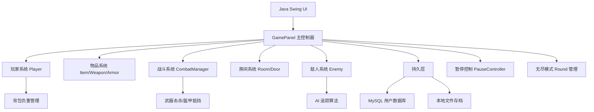

```markdown
 🎮 探险游戏（Zuul Adventure）

> 软件工程实训 · 小组协同开发项目 · Java Swing 图形化冒险游戏

[](https://classroom.github.com/a/u1xW62gh)

---

 📖 项目简介

探险游戏（Zuul Adventure)是一款基于 Java Swing 开发的 2D 图形化冒险游戏。玩家在由多个主题房间构成的迷宫世界中探索，收集物品、与敌人战斗、管理背包负重，并挑战无尽模式。

本项目从经典的文本冒险游戏 World of Zuul 演变而来，将传统的命令行交互升级为现代化的图形化界面，并引入了 MySQL 数据库用户系统、本地存档/读档机制、无尽循环关卡、AI 敌人追踪、背包负重系统 等丰富玩法，形成了一个完整的、可发布的游戏作品。

本项目是 《软件工程实训》课程 · 小组协同开发任务 的实践成果，完整实践了从需求分析、系统设计、编码实现到 CI/CD 部署的软件开发全流程。

---

 ✨ 核心功能总览

| 功能模块 | 说明 |
| 🎮 图形化游戏界面 | 基于 Java Swing 构建，包含主游戏画布、玩家信息侧边栏、房间物品面板、底部操作提示栏 |
| 👤 用户系统 | MySQL 数据库存储用户账号，支持注册、登录、记住密码、游客模式 |
| 💾 存档/读档系统 | 本地文件序列化保存游戏进度（房间索引、轮数、背包、血量、位置等），下次可继续游戏 |
| ♾️ 无尽模式 | 8 个不同主题房间循环，每轮敌人速度提升、尖刺比例增加、补给物品减少 |
| ⚔️ 战斗系统 | 持有武器可一击击杀敌人；持有盔甲可抵挡一次攻击并弹开敌人；无装备则游戏结束 |
| 🎒 背包与负重系统 | 每种物品有独立重量，负重影响移动速度，负重过高时减速，可使用道具提升负重上限 |
| 🧪 多样化道具系统 | 生命药水、加速药水（无视负重）、幽灵药水（穿墙）、眩晕药水（定身敌人）、魔法饼干（增加负重上限）、钥匙（开锁） |
| 🤖 AI 敌人 | 红色追击者自动追踪玩家，速度随轮数递增，可被眩晕药水定身 3 秒 |
| 📊 排行榜系统 | 基于 MySQL 存储玩家最高分、游戏场次、总得分，登录后可查看排行榜 |
| ⌨️ 键盘操作 | WASD/方向键移动，空格拾取，I 背包，L 查看，B 返回，P 暂停，ESC 保存退出 |
| 🔧 自动化流水线 | GitHub Actions 自动代码格式检查 + Maven 自动打包生成可执行 JAR |

---

 🏗️ 技术架构

 整体架构图



 技术栈

| 层级 | 技术 |
|------|------|
| 前端 | Java Swing（图形界面）、Graphics2D（2D 渲染） |
| 后端逻辑 | Java 8+（OOP 设计、事件驱动） |
| 数据库 | MySQL 8.0（用户管理、排行榜） |
| 存档 | Java 序列化（本地文件） |
| 构建工具 | Apache Maven 3.6+ |
| 版本控制 | Git + GitHub（分支策略、PR 流程） |
| CI/CD | GitHub Actions（代码检查 + 自动打包） |
| 代码规范 | Google Java Format（fmt-maven-plugin） |

 包结构

```text
src/main/java/cn/edu/whut/sept/zuul/
├── graphics/                       游戏核心包
│   ├── GamePanel.java              主游戏面板（2000+ 行，核心逻辑）
│   ├── GameFrame.java              游戏窗口（登录→主界面）
│   ├── Player.java                 玩家对象（位置、背包、负重）
│   ├── Enemy.java                  敌人 AI（追踪、眩晕、速度调整）
│   ├── Item.java                   物品基类（名称、描述、重量、位置）
│   ├── Weapon.java                 武器类（继承 Item）
│   ├── Armor.java                  盔甲类（继承 Item）
│   ├── Room.java                   房间类（名称、颜色、物品列表）
│   ├── Door.java                   普通门
│   ├── KeyDoor.java                钥匙门（内部类）
│   ├── Obstacle.java               障碍物（尖刺/普通，内部类）
│   ├── PowerUp.java                道具拾取
│   ├── CombatManager.java          战斗管理器
│   └── PauseController.java        暂停控制器
├── UserManager.java                用户管理器（MySQL CRUD）
├── User.java                       用户数据模型
├── LoginDialog.java                登录/注册对话框
├── GameSaveManager.java            存档管理器（本地文件）
├── GameSaveData.java               存档数据模型（可序列化）
└── ScoreBoardDialog.java           排行榜对话框
```

---

 🎮 游戏机制详解

 1. 玩家系统

- 移动控制：WASD/方向键，速度受负重影响（负重越高速度越慢）
- 生命值：初始 100，触碰尖刺 -20，可拾取生命药水恢复
- 背包系统：每个物品有重量，总负重上限 30kg（可通过魔法饼干增加）
- 状态效果：
   - 幽灵模式（5 秒穿墙）
   - 加速效果（5 秒无视负重）
   - 无敌状态（受伤后 0.5 秒）

 2. 战斗系统

| 场景 | 结果 |
|------|------|
| 持有武器 + 触碰敌人 | 消耗武器，击杀敌人，敌人掉落随机战利品 |
| 持有盔甲 + 触碰敌人 | 消耗盔甲，抵挡攻击，玩家和敌人弹开，获得短暂加速 |
| 无武器无盔甲 + 触碰敌人 | 游戏结束 |

 3. 无尽模式机制

- 房间池：8 个主题房间（森林、洞穴、深渊、废墟、墓地、地牢、神殿、火山口）
- 循环规则：走出第 8 个房间 → 回到第 1 个房间，轮数 +1
- 难度递增（每轮）：
   - 敌人速度：+0.3（上限 7.0）
   - 尖刺比例：+2%（上限 50%）
   - 物品数量：-1（最少 5 个）

 4. 敌人 AI

- 追踪逻辑：每帧计算玩家与敌人的方向向量，按固定速度移动
- 眩晕状态：使用眩晕药水可使敌人定身 3 秒（显示星星和 Z 字符号）
- 速度调整：根据轮数动态提升，基础速度 2.5，上限 5.0

 5. 物品系统

| 物品 | 重量 | 效果 |
|------|------|------|
| 生命药水 | 3 | 恢复 20 生命 |
| 魔法饼干 | 2 | 负重上限 +5 |
| 幽灵药水 | 3 | 5 秒穿过障碍物 |
| 加速药水 | 2 | 5 秒无视负重 |
| 眩晕药水 | 3 | 敌人眩晕 3 秒 |
| 钥匙 | 4 | 打开锁着的门 |
| 武器（铁剑/石斧/匕首等） | 3-8 | 击杀敌人 |
| 盔甲（皮甲/锁子甲等） | 8-14 | 抵挡一次攻击 |

---

 📦 快速开始

 环境要求

- JDK：8 或更高版本
- MySQL：8.0 或 5.7（需创建 `zuul_game` 数据库）
- Maven：3.6+（或使用 IDEA 内置 Maven）
- IDE：推荐 IntelliJ IDEA

 安装步骤

 1. 克隆仓库

```bash
git clone https://github.com/wutcst/kai-fa-freak-syndicate.git
cd kai-fa-freak-syndicate
```

 2. 创建数据库

使用 Navicat 或命令行执行：

```sql
CREATE DATABASE IF NOT EXISTS zuul_game;
USE zuul_game;

CREATE TABLE IF NOT EXISTS users (
    username VARCHAR(50) PRIMARY KEY,
    password VARCHAR(32) NOT NULL,
    highest_score INT DEFAULT 0,
    total_games INT DEFAULT 0,
    total_score INT DEFAULT 0
);
```

 3. 修改数据库配置

打开 `src/main/java/cn/edu/whut/sept/zuul/UserManager.java`，修改第 23-24 行：

```java
private static final String DB_USER = "root";        // 你的 MySQL 用户名
private static final String DB_PASS = "你的密码";    // 你的 MySQL 密码
```

 4. 打包运行

```bash
 使用 Maven 打包
mvn clean package

 运行 JAR
java -jar target/zuul-game.jar
```

 5. 或直接在 IDEA 中运行

- 打开 `GameFrame.java`
- 右键 → `Run 'GameFrame.main()'`

---

 ⌨️ 操作指南

| 按键 | 功能 | 说明 |
|------|------|------|
| `W` / `↑` | 向上移动 | 向当前方向前进 |
| `A` / `←` | 向左移动 | 向当前方向前进 |
| `S` / `↓` | 向下移动 | 向当前方向前进 |
| `D` / `→` | 向右移动 | 向当前方向前进 |
| `空格` | 拾取物品 | 拾取附近高亮物品 |
| `I` | 背包 | 打开/关闭背包查看物品 |
| `L` | 查看房间 | 显示当前房间所有物品 |
| `B` | 返回 | 返回上一个房间 |
| `P` | 暂停/恢复 | 暂停游戏，防止被攻击 |
| `ESC` | 保存退出 | 弹出确认框，保存进度后退出 |
| `R` | 重新开始 | 重置所有游戏状态 |
| `数字键 1-9` | 丢弃物品 | 暂停时按数字键丢弃对应物品 |

---

 📁 项目结构（完整目录树）

```text
kai-fa-freak-syndicate/
├── .github/
│   └── workflows/
│       ├── checkstyle.yml         代码格式检查流水线
│       └── build.yml               自动打包流水线
├── src/
│   └── main/
│       ├── java/
│       │   └── cn/edu/whut/sept/zuul/
│       │       ├── graphics/
│       │       │   ├── GamePanel.java
│       │       │   ├── GameFrame.java
│       │       │   ├── Player.java
│       │       │   ├── Enemy.java
│       │       │   ├── Item.java
│       │       │   ├── Weapon.java
│       │       │   ├── Armor.java
│       │       │   ├── Room.java
│       │       │   ├── Door.java
│       │       │   ├── PowerUp.java
│       │       │   ├── CombatManager.java
│       │       │   └── PauseController.java
│       │       ├── UserManager.java
│       │       ├── User.java
│       │       ├── LoginDialog.java
│       │       ├── GameSaveManager.java
│       │       ├── GameSaveData.java
│       │       ├── ScoreBoardDialog.java
│       │       └── Main.java
│       └── resources/
│           └── player.png          玩家角色图片
├── target/                         编译输出目录
│   └── zuul-game.jar               可执行文件
├── lib/                            第三方库
│   └── mysql-connector-j-8.0.33.jar
├── pom.xml                         Maven 配置文件
├── README.md                       项目介绍文档
├── REPORT.docx                     实训报告（电子版）
└── .gitignore
```

---

 🔧 自动化流水线（CI/CD）

 代码格式检查

使用 Google Java Format 插件自动检查代码风格：

```bash
 检查格式
mvn fmt:check

 自动格式化
mvn fmt:format
```

 GitHub Actions 工作流

| 工作流 | 触发条件 | 执行内容 |
|--------|----------|----------|
| Checkstyle | 每次 `push` 到 `dev`/`master` | 检查代码格式是否符合 Google Java Style |
| Build | 每次 `push` 到 `dev`/`master` | 编译、打包、上传 JAR 作为 Artifact |

 Maven 打包

```bash
 清理并打包（含所有依赖）
mvn clean package

 输出：target/zuul-game.jar（可双击运行）
```

---

 👥 小组成员与分工

| 角色 | 姓名 | 主要贡献 | 工作量占比 |
|------|------|----------|------------|
| 组长 | xxx | 项目架构设计、核心逻辑开发、MySQL 集成、存档系统 | 30% |
| 组员 | xxx | 图形界面优化、道具系统、UI 设计、无尽模式 | 25% |
| 组员 | xxx | 战斗系统、敌人 AI、测试、Bug 修复 | 25% |
| 组员 | xxx | 存档系统、打包部署、CI/CD 配置、文档编写 | 20% |

---

 📄 开发规范

 代码规范

- 语言：Java 8
- 风格：Google Java Style Guide
- 工具：`fmt-maven-plugin` 自动检查
- 命名：
   - 类名：大驼峰（PascalCase）
   - 方法/变量：小驼峰（camelCase）
   - 常量：全大写 + 下划线

 分支策略

```text
master (稳定版)
   ↑
dev (开发主分支)
   ↑
feature/ (特性分支)
   ↑
fix/ (修复分支)
```

 提交规范

```text
feat: 新增功能
fix: 修复 Bug
docs: 文档更新
chore: 构建/工具配置
refactor: 代码重构
test: 测试相关
```

 PR 流程

1. 创建 `feature/` 分支 → 开发
2. 提交 PR 到 `dev` 分支
3. 代码审查（至少 1 人批准）
4. 自动检查通过（CI）
5. 合并到 `dev`

---

 📝 实训报告说明

 报告内容要求

1. 需求分析：功能列表、用例图
2. 系统设计：类图、时序图、数据库设计
3. 实现细节：核心代码片段、算法说明
4. 测试报告：测试用例、Bug 修复记录
5. 小组协作：分工记录、会议纪要、提交记录
6. AI 使用说明：使用的 AI 工具及辅助内容

 文件位置

- 电子版：`REPORT.docx` / `REPORT.pdf`（项目根目录）
- 视频展示：[Bilibili 链接]（标题前缀：【武理26软工实践】）

---

 🎥 展示视频

> 视频链接：[请替换为实际 Bilibili 链接]

视频内容：
1. 项目概述（1 分钟）
2. 功能演示（3 分钟）
3. 代码结构讲解（2 分钟）
4. 开发流程回顾（2 分钟）

---

 📊 开发统计

| 指标 | 数据 |
|------|------|
| 代码行数 | ~2500 行（含注释） |
| 类数量 | 18 个 Java 类 |
| 功能点 | 15+ 核心功能 |
| 提交次数 | 20+ 次 |
| 开发周期 | 2 周 |
| 小组成员 | 4 人 |

---

 📚 参考文献

1. [World of Zuul 原始项目](https://github.com/wutcst/world-of-zuul)
2. [Java Swing 官方文档](https://docs.oracle.com/javase/tutorial/uiswing/)
3. [Maven 官方文档](https://maven.apache.org/)
4. [Google Java Style Guide](https://google.github.io/styleguide/javaguide.html)
5. [GitHub Actions 文档](https://docs.github.com/actions)
6. [MySQL 8.0 参考手册](https://dev.mysql.com/doc/refman/8.0/en/)

---

 📧 联系方式

- 仓库地址：https://github.com/wutcst/kai-fa-freak-syndicate
- 问题反馈：[提交 Issue](https://github.com/wutcst/kai-fa-freak-syndicate/issues)
- 邮箱：xxx@whut.edu.cn

---

 📄 License

本项目仅供 武汉理工大学 · 软件工程实训 教学使用。

---

🎉 感谢阅读！欢迎 Star ⭐ 和 Fork！

Happy Coding! 🚀
```

---

 占位内容替换清单

| 占位内容 | 替换为 |
|----------|--------|
| `xxx`（小组成员姓名） | 实际姓名 |
| `[Bilibili 链接]` | 实际视频链接 |
| `REPORT.docx` | 实际报告文件名 |
| `xxx@whut.edu.cn` | 实际联系邮箱 |

---

 提交 README.md

```bash
git add README.md
git commit -m "docs: 完善项目介绍文档 README.md"
git push origin feature/save-system
```

然后通过 PR 合并到 `dev` 分支。